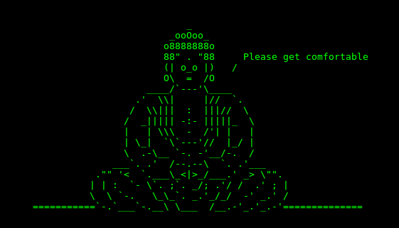

### ABOUT THIS PROGRAM

Meditation timer (v0.4.0) is a simple program to assist in the practice of
mindfulness. The ascii terminal interface provides a meditation timer that
plays chimes at the start and the end of the meditation session and, optionally,
at regular intervals.

It has been tested under Linux with python3.6+.



### FEATURES

 - Set duration of preparation and meditation periods
 - Choose number of bells to play before and after the meditation period
 - Add optional bells at intervals during meditation
 - Use as a pomodoro timer! (see details in the `Pomodoro` section)

### DEPENDENCIES

Meditation timer depends on:

- Python 3.6+
- pygame (`pip install pygame`)
- Linux (possibly works under MacOS)

### INSTALLING

In Linux, you have two options to use Meditation-timer:

#### 1) No installation

Simply put the program directory anywhere on your system. When you want to
launch the program, open a terminal and move into the directory (using 'cd').
Make sure the file `meditation_timer.py` executable. In the console, type:

```bash
 chmod +x meditation_timer.py
```

Launch the program:

```bash
./meditation_timer.py -h
```

Alternatively, add the `meditation-timer` directory to your `PATH` variable,
then launch with:

```bash
meditation_timer.py -h
```

#### 2) Installing

You can install meditation-timer via the 'install.sh' script. This will install
the Python program file ('meditation_timer.py') in the '/usr/local/bin'
directory and the data in '/usr/share/meditation-timer/'. In order to install
the program, you will need to have admnistrative rights on the computer you are
using. To proceed with the installation, launch the installation script (use
'sudo' to gain administrative rights):

```bash
sudo make install
```

The program is now installed. If there is a previous installation of
`meditation_timer` on your computer, run the following command to remove it
before doing the install:

```bash
sudo make uninstall
```

### USING THE PROGRAM

- Launch the program with the -h option to list available options.
  Open a terminal and lauch the following command:

```bash
meditation_timer.py -h
```

(Note: add './' before the command if the program was not installed or in your `PATH` variable)

You can also create a bash alias with your favorite settings. For example:

```bash
# No print, 5 minutes with 1 bell every minute
alias med='meditation_timer.py -n -p 5 -d 10 -i -I 1 >/dev/null'
```

### Pomodoro

If you like the pomodoro system (15 minutes of work and 5 minute breaks), you
can use the following alias:

```bash
alias pomodoro='while true; do meditation_timer.py -n -p 15 -d 3 -s 1 -e 2 >/dev/null; sleep 5m; done'
```

This will start a 15 minutes working session with one bell and then end it with
two bells. The session will be followed by a 5 minute break an then loop again 
until you stop it with `CTRL-C`.

You can save this alias by adding it to your `~/.bashrc` or `~/.bash_profile`
file, prefixing the line with `export `, like this:

```bash
export alias pomodoro='while true; do meditation_timer.py -n -p 15 -d 3 -s 1 -e 2 >/dev/null; sleep 5m; done'
```

### CONTACTING THE AUTHOR

You can send comments to the author at:

eric [dot] normandeau [dot] qc at gmail [dot] com

